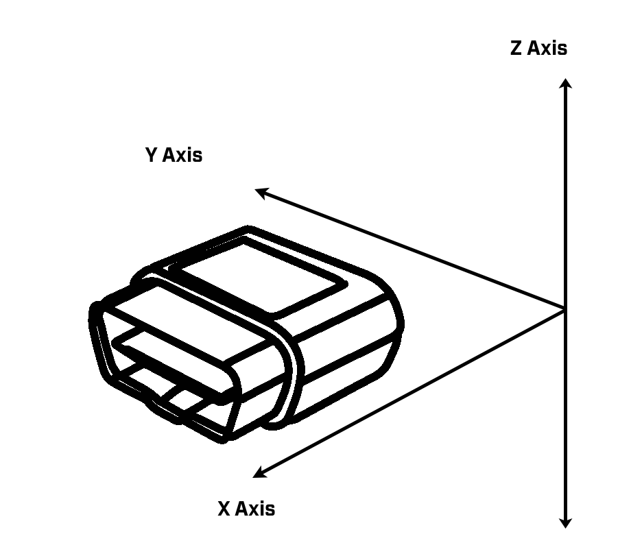
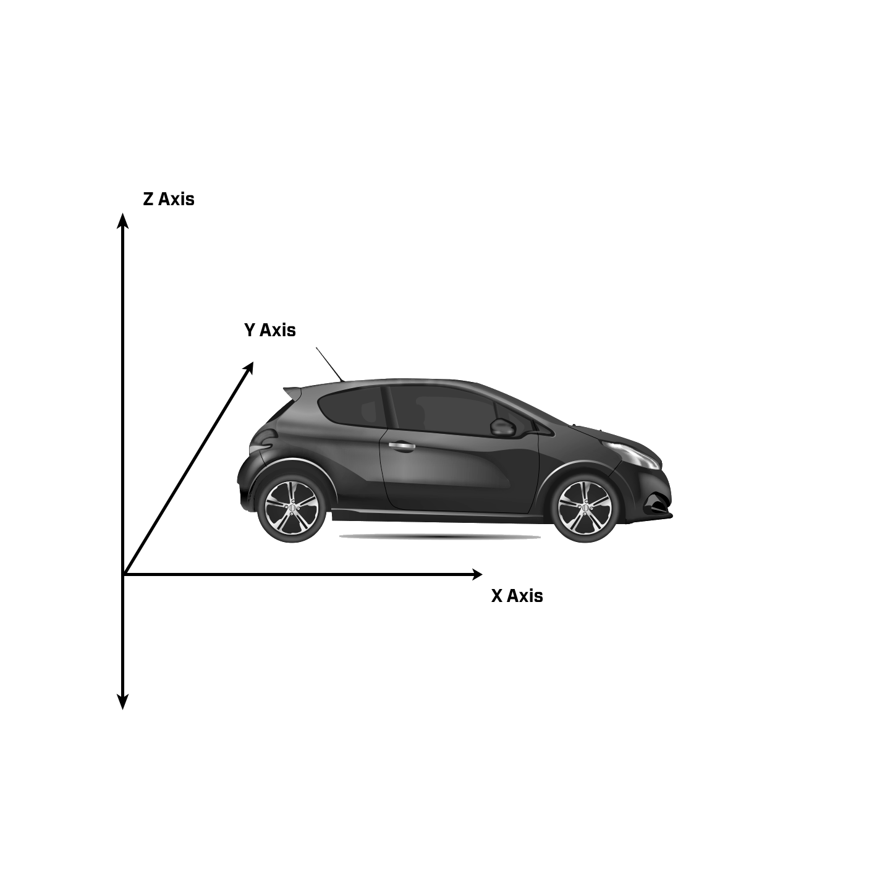

# PID Data Types

The collection of PID data depends on 3 factors:

1. *Vehicle support* for data collection on each PID.
Each vehicle is different and may not support all the different types of PID data. PID 0, PID 32, and PID 65 provide lists indicating the vehicle's support for each PID.

2. *Datalogger configuration,* which tells the device which PIDs to try to collect from.
The datalogger can be configured to collect data from a maximum of 32 PIDs.

3. *Availability of the vehicle component at the request time.*
The appearance of any PID data in a Trip Data event is uncertain, as it depends on whether the component providing the data
was available to answer the device's request at the time. If the component was available, the data appears in the `pidData` object inside the Trip Data event.

## <a name="pids-supported-1-32"></a> (PID 0) PIDs Supported 1-32

This ordered list of PIDs 1-32 provides a boolean value to indicate whether the
vehicle supports providing data for each PID number.

### Attributes

- SupportedPids1to32: (array[boolean]) - Each element in this ordered list indicates vehicle support for data collection on the corresponding PID.

### Example

```json
{
  "SupportedPids1to32": [
    false,
    false,
    true,
    true,
    true,
    false,
    true,
    true,
    true,
    false,
    true,
    false,
    true,
    false,
    false,
    false,
    true,
    false,
    true,
    true,
    false,
    true,
    false,
    false,
    true,
    false,
    true,
    false,
    false,
    true,
    false,
    true
  ]
}
```

## <a name="mil-status"></a> (PID 1) MIL Status

Describes the condition of the Malfunction Indicator Lamp and related vehicle diagnostics.

### Attributes

- MilStatus: (object)
  - commandedOn: `true` (boolean) - Whether the malfunction indicator lamp was commanded to turn on by the vehicle.
    - Members:
      - `true` - Indicates that the lamp was commanded to turn on by one of the vehicle's computers.
      - `false` - Probably indicates that a lamp is on because of a faulty wire in the dashboard.
  - numCodes: `2` (number) - Total number of current diagnostic trouble codes, not just the code(s) triggering the MIL.
  - statusSupported: (object) - Describes the presence of vehicle system monitoring, and the vehicle's support for reporting on its systems' statuses. Similar to the supported PID list, but aggregated by vehicle system.
    - comprehensiveMonitoringStatus: `true` (boolean)
    - fuelSystemMonitoringStatus: `true` (boolean)
    - misfireMonitoringStatus: `true` (boolean)
    - comprehensiveMonitoringSupported: `false` (boolean)
    - fuelSystemMonitoringSupported: `true` (boolean)
    - misfireMonitoringSupported: `false` (boolean)
    - egrSystemMonitoringStatus1: `true` (boolean)
    - oxygenSensorHeaterMonitoringStatus1: `false` (boolean)
    - oxygenSensorMonitoringStatus1: `true` (boolean)
    - acSystemRefrigerantMonitoringStatus1: `false` (boolean)
    - secondaryAirSystemMonitoringStatus1: `true` (boolean)
    - evaporativeSystemMonitoringStatus1: `false` (boolean)
    - heatedCatalystMonitoringStatus1: `true` (boolean)
    - catalystMonitoringStatus1: `false` (boolean)
    - egrSystemMonitoringStatus2: `true` (boolean)
    - oxygenSensorHeaterMonitoringStatus2: `false` (boolean)
    - oxygenSensorMonitoringStatus2: `true` (boolean)
    - acSystemRefrigerantMonitoringStatus2: `false` (boolean)
    - secondaryAirSystemMonitoringStatus2: `true` (boolean)
    - evaporativeSystemMonitoringStatus2: `false` (boolean)
    - heatedCatalystMonitoringStatus2: `true` (boolean)
    - catalystMonitoringStatus2: `false` (boolean)

### Example

```json
{
  "MilStatus": {
    "commandedOn": true,
    "numCodes": 2,
    "statusSupported": {
      "comprehensiveMonitoringStatus": "true", 
      "fuelSystemMonitoringStatus": "true",
      "misfireMonitoringStatus": "true",
      "comprehensiveMonitoringSupported": "false",
      "fuelSystemMonitoringSupported": "true",
      "misfireMonitoringSupported": "false",
      "egrSystemMonitoringStatus1": "true",
      "oxygenSensorHeaterMonitoringStatus1": "false",
      "oxygenSensorMonitoringStatus1": "true",
      "acSystemRefrigerantMonitoringStatus1": "false",
      "secondaryAirSystemMonitoringStatus1": "true",
      "evaporativeSystemMonitoringStatus1": "false",
      "heatedCatalystMonitoringStatus1": "true",
      "catalystMonitoringStatus1": "false",
      "egrSystemMonitoringStatus2": "true",
      "oxygenSensorHeaterMonitoringStatus2": "false",
      "oxygenSensorMonitoringStatus2": "true",
      "acSystemRefrigerantMonitoringStatus2": "false",
      "secondaryAirSystemMonitoringStatus2": "true",
      "evaporativeSystemMonitoringStatus2": "false",
      "heatedCatalystMonitoringStatus2": "true",
      "catalystMonitoringStatus2": "false"
    }
  }
}
```

## <a name="freeze-dtc"></a> (PID 2) Freeze DTC

Provides the DTC that triggered a freeze frame data storage.

A freeze frame is a data table that provides a snapshot of the vehicle conditions that
were present when an emissions-related DTC was stored. DataLogger cannot obtain the data table, 
only the DTC that triggered it.

### Attributes

- FreezeFrameTroubleCode: `B1111` (string) - DTC that triggered a freeze frame data storage.

### Example

```json
{
  "FreezeFrameTroubleCode": "B1111"
}
```

## <a name="fuel-system-status"></a> (PID 3) Fuel System Status

The fuel system status shows whether there were any errors or conditions affecting the fuel feedback control loop.

_Open loop_ refers to a state of the fuel system when the computer is not using input from engine sensors to regulate the air-fuel ratio, and orders a fixed, rich fuel mixture.

_Closed loop_ is the state of the fuel system when the computer is using feedback from the engine sensors to regulate the air-fuel ratio and enhance efficiency.

### Attributes

- FuelStatus (object)
  - closedLoop02SensorFault: `false` (boolean)
    - Members
      - `true`- Indicates that the computer thinks there is a problem with one of the oxygen sensors. Vehicle will continue to maintain a closed loop state, but with “fault” indicated.
      - `false`- No problem indicated with the oxygen sensors. The expected value for this field in a healthy vehicle.
  - openLoopSystemFault: `false` (boolean)
    - Members
      - `true`- Indicates that the processor thinks there is a problem with multiple engine sensors. Vehicle will maintain an open loop state.
      - `false`- No problem indicated with any sensors. The expected value for this field in a healthy vehicle.
  - openLoopDrivingConditions: `false` (boolean)
    - Members
      - `true` - Indicates that open loop state is maintained due to driving conditions (e.g. power enrichment, enleanment).
      - `false` - No driving conditions are triggering an open loop. The expected value for this field in a healthy vehicle.
  - closedLoopO2SensorFuelControl: `true` (boolean)
    - Members
      - `true` - Indicates that the vehicle is using oxygen sensors as feedback for air-fuel ratio regulation. The expected value for this field in a healthy vehicle.
      - `false` - Vehicle is not using the oxygen sensors as feedback for air-fuel ratio regulation.
  - openLoopNotYetSatisfied: `false` (boolean)
    - Members
      - `true` - Vehicle is pending use of the oxygens sensors as feedback for air-fuel ratio regulation (possibly because the engine is cold or because the computer has been reset or one of the oxygen sensors has been recently replaced). 
      - `false` - Vehicle is not pending use of the oxygen sensors.

### Example

```json
{
  "FuelStatus": {
    "closedLoopO2SensorFault": false,
    "openLoopSystemFault": false,
    "openLoopDrivingConditions": false,
    "closedLoopO2SensorFuelControl": true,
    "openLoopNotYetSatisfied": false
  }
}
```

## <a name="calculated-engine-load"></a> (PID 4) Calculated Engine Load

Calculated engine load percent is a comparison of the actual engine output torque to the
maximum engine output torque at the current RPMs. Maximum outputs are manufacturer-supplied values from a table in the engine's computer.

Values for this field range from 0 to 100.

### Attributes

- CalcEngineLoad: `67` (number) - Amount of peak available torque in percentage.

### Example

```json
{
  "CalcEngineLoad": 67
}
```

## <a name="engine-coolant-temp"></a> (PID 5) Engine Coolant Temperature

The engine coolant temperature is used as feedback to adjust engine controls such as fuel injection and ignition
timing.

Values for this field range from -40 to 215.

### Attributes

- EngineCoolantTemp: `93` (number) - Temperature of engine coolant in degrees Celsius.

### Example

```json
{
  "EngineCoolantTemp": 93
}
```

## <a name="fuel-percent-trim-sl-b1b2"></a> (PIDs 6-9) Fuel Percent Trim (Short, Long) Banks 1-2

Short-term fuel trim indicates the instantaneous effort of the computer to adjust the air-fuel ratio. Short-term fuel trim is not stored in memory and resets to 0 at the beginning of every trip.

Healthy values for this field typically oscillate between a negative integer and a corresponding postive integer (e.g. -10 and 10).

Long-term fuel trim is calculated over time while the fuel system is in a closed loop state and is stored in the keep-alive memory. In some vehicles, this value is used for open loop fuel calculations (like start-up and wide-open throttle). Long-term fuel trim is a coarser adjustment than short-term, and works to keep short-term fuel trim within specification. Once the vehicle has learned its typical range, it will monitor long-term fuel trim for adherence to this range as an indicator of engine health.

Healthy values for this field typically oscillate between a negative integer and a corresponding postive integer (e.g. -10 and 10).

Values for these fields range from -100 to 99.25.
+ Value = 0 indicates no change to air-fuel ratio.
+ Value > 0 indicates an effort to richen the mixture (decrease the air-fuel ratio).
+ Value < 0 indicates an effor to make the mixture leaner (increase the air-fuel ratio). 

There are 4 PIDs that provide this information:

- (PID 6) ShortTermFuelPrctTrimB1
- (PID 7) ShortTermFuelPrctTrimB2
- (PID 8) LongTermFuelPrctTrimB1
- (PID 9) LongTermFuelPrctTrimB2

### Attributes

- ShortTermFuelPrctTrimB1: `9.2` (number) - The short-term fuel trim in Bank 1 in percentage.

### Example

```json
{
  "ShortTermFuelPrctTrimB1": 9.2
}
```

## <a name="fuel-pressure"></a> (PID 10) Fuel Pressure

The pressure of the fuel in the fuel line. Location of this fuel pressure sensors varies by make and model.

Values for this field range from 0 to 765.

### Attributes

-  FuelPressure: `312` (number) - Pressure in the fuel line in kilopascals.

### Example

```json
{
  "FuelPressure": 312
}
```

## <a name="intake-manifold-abs-pressure"></a> (PID 11) Intake Manifold Absolute Pressure

Pressure inside the intake manifold (MAP) is used to calculate the mass flowrate of air into the engine (in conjuction with other sensor readings), which is used to adjust engine controls such as fuel trim and ignition timing.

When the engine is not running, the pressure in the intake manifold is the same as the outside barometric pressure (approx. 101.325 kPa). At engine start, a vacuum is created inside the manifold by the pumping action of the pistons and the air flow restriction created by the throttle plate, and the pressure drops. At wide-open throttle or under light loads, pressure inside the intake manifold nearly equals the outside barometric pressure.

Data from this sensor can be used similarly to the mass air flow (MAF) sensor in PID 16. Most vehicles use either a MAP or a MAF sensor to adjust fuel trim and ignition timing, not both.

Values for this field range from 0 to 255.

### Attributes

-  IntakeManifoldAbsPressure: `200` (number) - Air pressure in the intake manifold in kilopascals.

### Example

```json
{
  "IntakeManifoldAbsPressure": 200
}
```

## <a name="engine-rpm"></a> (PID 12) Engine RPM

Engine RPM refers to the number of rotations of the engine's crank shaft in a minute.

Values for this field range from 0 to 16,383.

### Attributes

-  EngineRpm: `2000` (number) - Number of rotations of the crank shaft measured in revolutions per minute.

### Example

```json
{
  "EngineRpm": 2000
}
```

## <a name="vehicle-speed"></a> (PID 13) Vehicle Speed

The speed of the vehicle reported from the vehicle speed sensor in the transmission. Note: This speed is generally lower than the speed displayed on the speedometer.

Values for this field range from 0 to 255.

### Attributes

-  VehicleSpeed: `85` (number) - Vehicle speed measured in kilometers per hour.

### Example

```json
{
  "VehicleSpeed": 85
}
```

## <a name="timing-advance"></a> (PID 14) Timing Advance

Ignition timing sets the timing of the spark in the combustion chamber. Since the size of the combustion chamber is the most important factor for ignition, fuel injection timing is expressed as an angle relative to _Top Dead Center_, when the piston is nearest the valves and the chamber is its smallest.

Values for this field range from -210 to 301.992
+ Value = 0 inidicates that ignition is taking place at _Top Dead Center_.
+ Value > 0 indicates that ignition is taking place _After Top Dead Center_, when the piston is on its way down the chamber.
+ Value < 0 indicates that ignition is taking place _Before Top Dead Center_, when the piston is still on its way up the chamber.

Values for this field range from -64 to 63.5.

### Attributes

-  TimingAdvance: `-12` (number) - The timing of ignition relative to _Top Dead Center_ in degrees.

### Example

```json
{
  "TimingAdvance": -12
}
```

## <a name="intake-air-temp"></a> (PID 15) Intake Air Temperature

The intake air temperature sensor provides temperature readings taken near the intake manifold. The temperature is used to calculate the mass flowrate of air into the engine (in conjuction with other sensor readings), which is used to adjust engine controls such as fuel trim and ignition timing.

This temperature reading is not the same as the ambient temperature if the engine is warm, but would be the same as ambient temperature in a cold engine that has not been started.

In some vehicles, the intake air temperature is provided by the mass air flow (MAF) sensor described in PID 16.

Values for this field range from -40 to 215.

### Attributes

-  IntakeAirTemp: `13` (number) - Engine intake air temperature in degrees Celsius.

### Example

```json
{
  "IntakeAirTemp": 13
}
```

## <a name="mass-air-flow-rate"></a> (PID 16) Mass Air Flow Rate

The readings from the mass air flow (MAF) sensor can be used similarly to the intake manifold absolute pressure (MAP) sensor described in PID 11 and the intake air temperature sensor described in PID 15 to adjust engine controls such as fuel trim and ignition timing.

Most vehicles use either a MAP or a MAF sensor to adjust fuel trim and ignition timing, not both.

Values for this field range from 0 to 655.35.

### Attributes

-  MafAirFlowRate: `320` (number) - Air flow rate in grams per second.

### Example

```json
{
  "MafAirFlowRate": 320
}
```

## <a name="throttle-position"></a> (PID 17) Throttle Position

The throttle plate allows varying amounts of air into the engine based on its position. The computer uses this readig as feedback to adjust engine controls such as fuel injection and ignition timing. Throttle position is expressed as a percentage. A wide-open throttle (WOT) is 100%. 

Values for this field range from 0 to 100.

There are 3 PIDs that provide absolute throttle position.
- (PID 17) Throttle Position - The primary sensor.
- (PID 71) AbsoluteThrottlePositionB - Secondary sensor. May not be present in all vehicles.
- (PID 72) AbsoluteThrottlePositionC - Secondary sensor. May not be present in all vehicles.

### Attributes

- ThrottlePosition: `45` (number) - The position of the throttle in percentage.

### Example

```json
{
  "ThrottlePosition": 45
}
```

## <a name="commanded-secondary-air-status"></a> (PID 18) Commanded Secondary Air Status

Secondary air injection is a vehicle emissions control strategy where fresh air
is injected into the exhaust stream to allow for fuller combustion of exhaust
gases. This list shows where air is being injected.

Only one value will be true for all the properties.

### Attributes

- CommandedSecondaryAirStatus (object)
  - pumpCommandedOnForDiagnostics: `false`
  - fromOutsideAtmosphereOrOff: `true` (boolean)
  - downstreamOfFirstCatalyticConverter: `false` (boolean)
  - upstreamOfFirstCatalyticConverter: `false` (boolean)

### Example

```json
{
  "CommandedSecondaryAirStatus": {
    "pumpCommandedOnForDiagnostics": false,
    "fromOutsideAtmosphereOrOff": true,
    "downstreamOfFirstCatalyticConverter": false,
    "upstreamOfFirstCatalyticConverter": false
  }
}
```

## <a name="oxygen-sensors-present-s1-4"></a> (PID 19) Oxygen Sensors 1-4 Present

This list of oxygen sensors provides a boolean value to indicate whether the vehicle has the following oxygen sensors.

This list is similar to the list in PID 29, which organizes oxygen sensors by bank. It's important to note that manufacturer reporting on oxygen sensors is highly variable. Using this PID does not mean that the reporting vehicle does not have two banks, and using PID 29 does not necessarily indicate the presence of two banks in the vehicle.

Most vehicles will report the presence of oxygen sensors on either PID 19 or PID 29, but not both.

### Attributes

- OxygenSensorsPresent: (object)
  - sensor1: `true` (boolean) - Presence of sensor 1 in the vehicle.
  - sensor2: `false` (boolean) - Presence of sensor 2 in the vehicle.
  - sensor3: `false` (boolean) - Presence of sensor 3 in the vehicle.
  - sensor4: `false` (boolean) - Presence of sensor 4 in the vehicle.

### Example

```json
{
  "OxygenSensorsPresent": {
    "sensor1": true,
    "sensor2": false,
    "sensor3": false,
    "sensor4": false
  }
}
```

## <a name="oxygen-sensor-volts-and-trim"></a> (PIDs 20-27) Oxygen Sensor Voltage and Trim Banks 1-2 and Sensors 1-4

Oxygen sensors in the exhaust manifold provide data that the computer uses to adjust engine controls such as air-fuel ratio and ignition timing.

An oxygen sensor will typically generate up to about 0.9 volts when the fuel mixture is rich (lower air-fuel ratio) and there is little unburned oxygen in the exhaust. When the mixture is lean (higher air-fuel ratio), the sensor's output voltage will drop down to about 0.1 volts. When the air-fuel mixture is at the equilibrium point (generally 14.7:1), the sensor will read around 0.45 volts.

Values for this field range from 0 to 1.275.

The oxygen sensor also provides short-term fuel trim. Short-term fuel trim indicates the instantaneous effort of the computer to adjust the air-fuel ratio. Healthy values for this field typically oscillate between a negative integer and a corresponding postive integer (e.g. -10 and 10).

Values for this field range from -100 to 99.22.
+ Value = 0 indicates no change to air-fuel ratio.
+ Value > 0 indicates an effort to richen the mixture (decrease the air-fuel ratio).
+ Value < 0 indicates an effor to make the mixture leaner (increase the air-fuel ratio).

There are 8 PIDs that provide this data:

- (PID 20) OxygenSensorVoltageB1S1
- (PID 21) OxygenSensorVoltageB1S2
- (PID 22) OxygenSensorVoltageB1S3
- (PID 23) OxygenSensorVoltageB1S4
- (PID 24) OxygenSensorVoltageB2S1
- (PID 25) OxygenSensorVoltageB2S2
- (PID 26) OxygenSensorVoltageB2S3
- (PID 27) OxygenSensorVoltageB2S4

These PIDs provide similar data to that which is provided in PIDs 36-43 and Pids 52-59. Wide variance should be expected as to which sensors report on which PIDs, and because sensor 1 uses PID 20 does not necessarily indicate that sensor 2 would use PID 21.

### Attributes

- OxygenSensorVoltageB1S1: (object)
   - voltage: `0.418` (number) - The voltage generated at the oxygen sensor in volts.
   - shortTermFuelTrim: `9.52` (number) - The instantaneous change that the computer is making to the air-fuel ratio in percentage.

### Example

```json
{
  "OxygenSensorVoltageB1S1": {
    "voltage": 0.418,
    "shortTermFuelTrim": 9.52
  }
}
```

## <a name="obd-standard-conformation"></a> (PID 28) OBD Standard Conformation

Lists the OBD standards that the vehicle conforms to.

### Attributes

- ObdStandards: `OBDII` (enum[string]) - The OBD standards that the vehicle conforms to.
  - Members
    - `NONE` - The vehicle does not comply with any OBD standard.
    - `OBDI` - Manufacturer-specific protocols for on-board diagnostics. Present in some vehicles before 1996.
    - `OBDII` - Protocol for on-board diagnostics developed by the California Air Resources Board. Present in most American-sold vehicles since 1996.
    - `OBD` - Protocols for on-board diagnostics developed by the Environmental Protection Agency.
    - `OBDAndOBDII`- Utilizes both the EPA-developed and CARB-develped protocols for on-board diagnostics.
    - `EOBD` - Standardized European protocol for on-board diagnostics. Present in most European-sold vehicles since 2001.

### Example

```json
{
  "ObdStandards": "OBDII"
}
```

## <a name="oxygen-sensors-present-banks-1-4"></a> (PID 29) Oxygen Sensors Present Banks 1-4

This list of oxygen sensors is organized by bank, and provides a boolean value to indicate whether the vehicle has the following oxygen sensors.

This list is similar to the list in PID 19, which does not organize oxygen sensors by bank. It's important to note that manufacturer reporting on oxygen sensors is highly variable. Using this PID does not mean that the reporting vehicle has two banks, and using PID 19 does not necessarily indicate a single bank in the vehicle.

Most vehicles will report the presence of oxygen sensors on either PID 19 or PID 29, but not both.

### Attributes

- OxygenSensorsPresent2: (object)
  - bank1: (object)
    - sensor1: `true` (boolean) - Presence of sensor 1 in the vehicle.
    - sensor2: `true` (boolean) - Presence of sensor 2 in the vehicle.
  - bank2: (object)
    - sensor1: `true` (boolean) - Presence of sensor 1 in the vehicle.
    - sensor2: `true` (boolean) - Presence of sensor 2 in the vehicle.
  - bank3: (object)
    - sensor1: `true` (boolean) - Presence of sensor 1 in the vehicle.
    - sensor2: `false` (boolean) - Presence of sensor 2 in the vehicle.
  - bank4: (object)
    - sensor1: `true` (boolean) - Presence of sensor 1 in the vehicle.
    - sensor2: `false` (boolean) - Presence of sensor 2 in the vehicle.

### Example

```json
{
  "OxygenSensorsPresent2": {
    "bank1": {
      "sensor1": true,
      "sensor2": true
    },
    "bank2": {
      "sensor1": true,
      "sensor2": true
    },
    "bank3": {
      "sensor1": true,
      "sensor2": true
    },
    "bank4": {
      "sensor1": true,
      "sensor2": true
    }
  }
}
```

## <a name="auxiliary-input-status"></a> (PID 30) Auxiliary Input Status

Auxiliary pumps are present in the transmissions of some heavy-duty vehicles to provide power to run auxiliary tools such as hydraulic pumps.


## <a name="run-time-since-engine-start"></a> (PID 31) Run Time Since Engine Start

The time that the engine has been running since the vehicle was started. This value resets at 65,535 seconds (about 18 hours).

Values for this field range from 0 to 65,535.

### Attributes

- RunTimeSinceEngineStart: `250` (number) - Time that the engine has been running in seconds.

### Example

```json
{
  "RunTimeSinceEngineStart": 250
}
```

## <a name="pids-supported-33-64"></a> (PID 32) PIDs Supported 33-64

This ordered list of PIDs 33-64 provides a boolean value to indicate whether the vehicle supports providing data for each PID number.

### Attributes

- SupportedPids33to64: (array[boolean]) - Each element in this ordered list indicates vehicle support for data collection on the corresponding PID.

### Example

```json
{
  "SupportedPids33to64": [
    false,
    false,
    true,
    true,
    true,
    false,
    true,
    true,
    true,
    false,
    true,
    false,
    true,
    false,
    false,
    false,
    true,
    false,
    true,
    true,
    false,
    true,
    false,
    false,
    true,
    false,
    true,
    false,
    false,
    true,
    false,
    true
  ]
}
```

## <a name="distance-traveled-with-mil-on"></a> (PID 33) Distance Traveled with MIL On

The distance traveled with a malfunction indicator lamp on.

Values for this field range from 0 to 65,535.

### Attributes

- DistanceTraveledMil: `2532` (number) - Distance in kilometers.

### Example

```json
{
  "DistanceTraveledMil": 2532
}
```

## <a name="fuel-rail-pressure-relative-manifold-vacuum"></a> (PID 34) Fuel Rail Pressure (Relative to Manifold Vacuum)

Fuel rail pressure readings (in conjunction with other sensors) are used to calculate fuel injection timing (length of time the fuel injector is open). 

The fuel rail pressure relative to the manifold vacuum describes the difference between the pressure in the rail and the pressure in the intake manifold when the piston is on its induction stroke.

Values for this field range from 0 to 5,177.265.

### Attributes

- FuelRailPressureRelative: `2132.247` (number) - The pressure differential between the fuel rail and the intake manifold in kilopascals.

### Example

```json
{
  "FuelRailPressureRelative": 2132.247
}
```

## <a name="fuel-rail-pressure-diesel-gas-direct-injection"></a> (PID 35) Fuel Rail Pressure (Diesel or Gasoline Direct Injection)

Fuel rail pressure readings, in conjunction with other sensors, are used to calculate fuel injection timing (length of time the fuel injector is open). This is an absolute pressure reading, and the range of values is suitable for reporting fuel rail pressure of direct injection engines (either diesel or gasoline), which are highly pressurized. 

Values for this field range from 0 to 655,350.

### Attributes

- FuelRailPressure: `200000` (number) - The pressure in the fuel rail of a direct injection engine in kilopascals.

### Example

```json
{
  "FuelRailPressure": 200000
}
```

## <a name="oxygen-sensor-1-8-equivalence-ratio-voltage"></a> (PID 36-43) Oxygen Sensors 1-8 Equivalence Ratio and Voltage

Oxygen sensors in the exhaust manifold provide data that the computer uses to adjust engine controls such as air-fuel ratio and ignition timing.

Each sensor indirectly provides the air-fuel ratio by reporting an equivalence ratio. The equivalence ratio represents the percentage of the actual air-fuel ratio compared to the vehicle's equilibrium air-fuel ratio (generally 14.7:1).

To obtain the actual air-fuel ratio, multiply the equilibrium air-fuel ratio (14.7) by the equivalence ratio.

Values for this field range from 0 to 2:
+ Value = 1 indicates that the air-fuel ratio is at equilibrium.
+ Value > 1 indicates that the fuel mixture is rich (lower air-fuel ratio). Most of the oxygen is burned, but much of the fuel is not.
+ Value < 1 indicates that the fuel mixture is lean (higher air-fuel ratio) Most of the fuel is burned, but much of the oxygen is not.

The oxygen sensor also provides its raw voltage.

Values for this field range from 0 to 8.

There are 8 PIDs that can provide this data:

- (PID 36) OxygenSensor1EquivalenceRatioVoltage
- (PID 37) OxygenSensor2EquivalenceRatioVoltage
- (PID 38) OxygenSensor3EquivalenceRatioVoltage
- (PID 39) OxygenSensor4EquivalenceRatioVoltage
- (PID 40) OxygenSensor5EquivalenceRatioVoltage
- (PID 41) OxygenSensor6EquivalenceRatioVoltage
- (PID 42) OxygenSensor7EquivalenceRatioVoltage
- (PID 43) OxygenSensor8EquivalenceRatioVoltage

These PIDs provide similar data to that which is provided in PIDs 20-27 and Pids 52-59. Wide variance should be expected as to which sensors report on which PIDs, and because sensor 1 uses PID 36 does not necessarily indicate that sensor 2 would use PID 37.

### Attributes

- OxygenSensor1EquivalenceRatioVoltage: object
  - ratio: `0.954` (number) - A value showing the air-fuel ratio oriented from the equilibrium value of 1.
  - voltage: `8` (number) - Voltage of oxygen sensor in volts.

### Example

```json
{
  "OxygenSensor1EquivalenceRatioVoltage": {
    "ratio": 0.954,
    "voltage": 8
  }
}
```

## <a name="commanded-egr"></a> (PID 44) Commanded Exhaust Gas Recirculation (EGR)

The exhaust gas recirculation valve is part of EGR system, which reduces nitrogen oxide emissions and reduces the peak combustion temperature in the combustion chamber. The EGR valve is opened and closed by the computer to recirculate a specified amount of exhaust into the air-fuel mixture.

Values for this parameter range from 0 to 100. 
+ Value = 0 indicates that the EGR valve is commanded to be fully closed.
+ Value > 0 indicates that EGR valve is commanded to be partially to fully open.

Although vehicles values for this PID vary, consistently high or low values would indicate a problem.

### Attributes

- CommandEgr: `35` (number) - The commanded openness of the EGR valve in percentage.

### Example

```json
{
  "CommandEgr": 35
}
```

## <a name="egr-error"></a> (PID 45) Exhaust Gas Recirculation (EGR) Error

The EGR Error rate represents the obedience of the valve to the command of the computer in regards to its position. 

Values range from -100 to 99.2.
+ Value = 0 indicates no error.
+ Value < 0 indicates that the EGR valve some percentage less open than the command.
+ Value > 0 indicates the EGR valve is some percentage more open than commanded.

### Example

- EgrError: `-40` (number) - The EGR valve position error expressed as a percent.

### Example

```json
{
  "EgrError": -40
}
```

## <a name="commanded-evap-purge"></a> (PID 46) Commanded Evaporative Purge

The evaporative purge valve is part of the evaporative emission control system, which prevents fuel vapors from escaping the fuel tank and polluting the environment.

The evaporative purge valve is opened and closed by the computer to send collected fuel vapors back into the engine for combustion. 

Values for this field range from 0 to 100.
+ Value = 0 indicates that the purge valve is commanded to be fully closed.
+ Value > 0 indicates that purge valve is commanded to be partially to fully open.

### Attributes

- CommandEvaporativePurge: `12` (number) - The commanded openness of the EVAP purge valve in percentage.

### Example

```json
{
  "CommandEvaporativePurge": 12
}
```

## <a name="fuel-level-input"></a> (PID 47) Fuel Level Input

The fill of the fuel tank as a percentage. This parameter does not reflect the actual quantity of gas in the tank. Fuel level is important because certain vehicle systems can only run diagnostic checks when the tank is between 15 and 85 percent full. 

Note: readings can vary widly during a single trip due to bumps in the road and topography.

Values for this field range from 0 to 100. 

### Attributes

- FuelLevelInput: `47` (number) - The fill of the tank in percentage.

### Example

```json
{
  "FuelLevelInput": 47
}
```

## <a name="num-warmups-since-codes-cleared"></a> (PID 48) Number of Warm-Ups Since Codes Cleared

This PID reports the number of warm-ups since all diagnostic trouble codes were cleared. A warm-up is defined as the engine coolant temperature rising at least 4 degrees Celsius above its temperature at engine start, and reaching a minimum temperature of 71 degrees Fahrenheit.

### Attributes

- NumWarmupsSinceCodesCleared: `30` (number) - Number of warm-ups since DTCs were cleared.

### Example

```json
{
  "NumWarmupsSinceCodesCleared": 30
}
```

## <a name="dist-since-codes-cleared"></a> (PID 49) Distance Traveled Since Codes Cleared

This PID reports distance traveled since all diagnostic trouble codes were cleared.

Values for this field range from 0 to 65,535.

### Attributes

- DistanceTraveledSinceCodesCleared: `840` (number) - Distance traveled since DTCs were cleared in kilometers.

### Example

```json
{
  "DistanceTraveledSinceCodesCleared": 840
}
```

## <a name="evap-vapor-pressure"></a> (PID 50) Evaporative System Vapor Pressure

The pressure in the EVAP system (e.g. lines, canister), where fuel vapor is collected while the vehicle is off.

Values for this field range from -8,192 to 8,192.

### Attributes

- EvapSystemVaporPressure: `23` (number) - Pressure in the EVAP canister in Pascals.

### Example

```json
{
  "EvapSystemVaporPressure": 23
}
```

## <a name="barometric-pressure"></a> (PID 51) Barometric Pressure

The barometric pressure provides a reading of atmospheric pressure at the vehicle's altitude.

Standard sea-level pressure is 101.325 kPA, and rarely increases or decreases more than 3.386 kPa.

Values for this reading range from 0 to 255.

### Attributes

- BarometricPressure: `101.325` (number) - Atmospheric pressure in kilopascals.

### Example

```json
{
  "BarometricPressure": 101.325
}
```

## <a name="oxygen-sensor-1-8-equivalence-ratio-current"></a> (PIDs 52-59) Oxygen Sensor 1-8 Equivalence Ratio Current

Oxygen sensors in the exhaust manifold provide data that the computer uses to adjust engine controls such as air-fuel ratio and ignition timing.

Each sensor indirectly provides the air-fuel ratio by reporting an equivalence ratio. The equivalence ratio represents the percentage of the actual air-fuel ratio compared to the equilibrium air-fuel ratio (generally 14.7:1).

To obtain the actual air-fuel ratio, multiply the equilibrium air-fuel ratio by the equivalence ratio.

Values for this field range from 0 to 2:
+ Value = 1 indicates that the air-fuel ratio is at equilibrium.
+ Value > 1 indicates that the fuel mixture is rich (lower air-fuel ratio). Most of the oxygen is burned, but much of the fuel is not.
+ Value < 1 indicates that the fuel mixture is lean (higher air-fuel ratio) Most of the fuel is burned, and much of the oxygen is not.

The oxygen sensors also provide feedback on the air-fuel ratio in milliamps. 

Values for this field range from -128 to 128 milliamperes.
+ Value = 0 indicates that the air-fuel ratio is at equilibrium.
+ Each milliamp > 0 is a percentage point lean.
+ Each milliamp < 0 is a percentage point rich.

There are 8 PIDs that provide this data:

- (PID 52) OxygenSensor1EquivalenceRatioCurrent
- (PID 53) OxygenSensor2EquivalenceRatioCurrent
- (PID 54) OxygenSensor3EquivalenceRatioCurrent
- (PID 55) OxygenSensor4EquivalenceRatioCurrent
- (PID 56) OxygenSensor5EquivalenceRatioCurrent
- (PID 57) OxygenSensor6EquivalenceRatioCurrent
- (PID 58) OxygenSensor7EquivalenceRatioCurrent
- (PID 59) OxygenSensor8EquivalenceRatioCurrent

These PIDs provide similar data to that which is provided in PIDs 20-27 and Pids 36-43. Wide variance should be expected as to which sensors report on which PIDs, and because sensor 1 uses PID 52 does not necessarily indicate that sensor 2 would use PID 53.

### Attributes

- OxygenSensor1EquivalenceRatioCurrent: object
- ratio: `1.012` (number) - A value showing the air-fuel ratio oriented from the equilibrium value of 1.
- current: `0.7` (number) - Current in milliamperes.

### Example

```json
{
  "OxygenSensor1EquivalenceRatioCurrent": {
    "ratio": 1.012,
    "current": 0.7
  }
}
```

## <a name="catalyst-temp-bank-sensor"></a> (PIDs 60-63) Catalyst Temperature Bank 1-2 Sensor 1-2

Temperature is read by the vehicle's oxygen sensors, and the temperature differential between sensors 1 and 2 of each bank provides information to determine the efficiency of the catalytic converter. The temperature from sensor 2 should provide a higher reading than sensor 1.

Values for each sensor range from -40 to 6,513.5.

There are 4 PIDs that provide this data:

- (PID 60) CatalystTemperatureBank1Sensor1
- (PID 61) CatalystTemperatureBank1Sensor2
- (PID 62) CatalystTemperatureBank2Sensor1
- (PID 63) CatalystTemperatureBank2Sensor2 - Only present if there are 2 catalytic converters.

### Attributes

- CatalystTemperatureBank1Sensor1: `326.2` (number) - The air temperature in degrees Celsius.

### Example

```json
{
  "CatalystTemperatureBank1Sensor1": 326.2
}
```

## <a name="pids-supported-65-96"></a> (PID 64) PIDs Supported 65-96

This ordered list of PIDs 65-96 provides a boolean value to indicate whether the
vehicle supports providing data for each PID number.

### Attributes

- SupportedPids65to96: (array[boolean]) - Each element in this ordered list indicates vehicle support for data collection on the corresponding PID.

### Example

```json
{
  "SupportedPids65to96": [
    false,
    false,
    true,
    true,
    true,
    false,
    true,
    true,
    true,
    false,
    true,
    false,
    true,
    false,
    false,
    false,
    true,
    false,
    true,
    true,
    false,
    true,
    false,
    false,
    true,
    false,
    true,
    false,
    false,
    true,
    false,
    true
  ]
}
```

## <a name="monitor-status-drive"></a> (PID 65) Monitor Status This Drive Cycle

Under certain vehicle and driving conditions, the vehicle will run diagnostic tests on its various systems to ensure that they are operating correctly. The definition of a drive cycle is manufacturer-specific. 

Each system is listed twice, and a boolean is provided, which indicates the availability of each of the systems, and whether the test was completed.

### Attributes

- MonitorStatusDriveCycle: (object)
  - misfireTestAvailable: `true` (boolean)
  - fuelSystemTestAvailable: `false` (boolean)
  - componentsTestAvailable: `true` (boolean)
  - catalystTestAvailable: `true` (boolean)
  - heatedCatalystTestAvailable: `true` (boolean)
  - evaporativeSystemTestAvailable: `true` (boolean)
  - secondaryAirSystemTestAvailable: `true` (boolean)
  - acRefrigerantTestAvailable: `true` (boolean)
  - oxygenSensorTestAvailable: `true` (boolean)
  - oxygenSensorHeaterTestAvailable: `true` (boolean)
  - egrSystemTestAvailable: `true` (boolean)
  - misfireTestComplete: `true` (boolean)
  - fuelSystemTestComplete: `false` (boolean)
  - componentsTestComplete: `false` (boolean)
  - catalystTestComplete: `false` (boolean)
  - heatedCatalystTestComplete: `false` (boolean)
  - evaporativeSystemTestComplete: `true` (boolean)
  - secondaryAirSystemTestComplete: `false` (boolean)
  - acRefrigerantTestComplete: `false` (boolean)
  - oxygenSensorTestComplete: `false` (boolean)
  - oxygenSensorHeaterTestComplete: `true` (boolean)
  - egrSystemTestComplete: `false` (boolean)

### Example

```json
{
  "MonitorStatusDriveCycle": {
    "misfireTestAvailable": true,
    "fuelSystemTestAvailable": false,
    "componentsTestAvailable": true,
    "catalystTestAvailable": true,
    "heatedCatalystTestAvailable": true,
    "evaporativeSystemTestAvailable": true,
    "secondaryAirSystemTestAvailable": true,
    "acRefrigerantTestAvailable": true,
    "oxygenSensorTestAvailable": true,
    "oxygenSensorHeaterTestAvailable": true,
    "egrSystemTestAvailable": true,

    "misfireTestComplete": true,
    "fuelSystemTestComplete": false,
    "componentsTestComplete": false,
    "catalystTestComplete": false,
    "heatedCatalystTestComplete": false,
    "evaporativeSystemTestComplete": true,
    "secondaryAirSystemTestComplete": false,
    "acRefrigerantTestComplete": false,
    "oxygenSensorTestComplete": false,
    "oxygenSensorHeaterTestComplete": true,
    "egrSystemTestComplete": false
  }
}
```

## <a name="control-module-voltage"></a> (PID 66) Control Module Voltage

Control module voltage shows the battery voltage as read by the computer. Any loss of voltage between the battery and the control module should be less than a few tenths of a volt.

Values for this field range from 0 to 65.535.

### Attributes

- ControlModuleVoltage: `12` - The voltage arriving at the control module in Volts.

### Example

```json
{
  "ControlModuleVoltage": 12
}
```

## <a name="absolute-load-value"></a> (PID 67) Absolute Load Value

The absolute load value is the air mass per intake stroke displayed as a percent, which indicates the pumping efficiency of the engine for diagnostic purposes. This data is often used to schedule ignition timing and EGR rates.

Values for this field range from 0 to 25,700.

### Attributes

- AbsoluteLoadValue: `66` (number) - The air mass of the intake stroke in percent.

### Example

```json
{
  "AbsoluteLoadValue": 66
}
```

## <a name="command-equivalence-ratio"></a> (PID 68) Commanded Equivalence Ratio

The commanded equivalence ratio compares the commanded air-fuel ratio to the vehicle's equilibrium air-fuel ratio (generally 14.7:1). To obtain the actual air-fuel ratio being commanded by the computer, multiply the equivalence ratio by the equilibrium air-fuel ratio.

e.g. If the fuel control system commands an equivalence ratio of 0.95, the desired air-fuel ratio would be 14.7 * 0.95 = 13.9:1.

Values for this field range from 0 to 2. 

### Attributes

- CommandEquivalenceRatio: `0.95` (number) - The percentage of the equilibrium air-fuel ratio as a decimal.
 
### Example

```json
{
  "CommandEquivalenceRatio": 0.95
}
```

## <a name="relative-throttle-position"></a> (PID 69) Relative Throttle Position

Relative throttle position indicates the learned throttle position. The computer controlling the throttle plate remaps the openness of the throttle from 0% to 100% based on the relative position of the accelerator pedal.

e.g. The accelerator pedal in a given vehicle is pressed down as far as it will go: the absolute throttle position may only be 94%, but the relative throttle position is 100%, because this is as far as the throttle actually opens.

Values for this field range from 0 to 100.

### Attributes

- ThrottlePosition: `15` (number) - The openness of the throttle as understood by the ECU.

### Example

```json
{
  "RelativeThrottlePosition": 15
}
```

## <a name="ambient-air-temp"></a> (PID 70) Ambient Air Temperature

The ambient air temperature sensor takes readings of the temperature of the air outside the vehicle. The computer uses this parameter to control blower speed and air temperature of automated HVAC systems.

Values for this field range from -40 to 215.

### Attributes

- AmbientAirTemperature: `13` (number) - The temperature of the air outside the vehicle in degrees Celsius.

### Example

```json
{
  "AmbientAirTemperature": 13
}
```

## <a name="absolute-throttle-position"></a> (PIDs 71-72) Absolute Throttle Position (B and C)

The throttle allows varying amounts of air into the engine based on its position. The computer uses this parameter to calculate the amount of air flow to the engine and the amount of fuel to be injected for the optimum air-fuel ratio. Throttle position is expressed as a percentage. A wide-open throttle (WOT) is 100%.

Absolute throttle position is the throttle position reading provided by the sensor(s), as opposed to the computer.

Values for this field range from 0 to 100.

There are 3 PIDs that provide absolute throttle position.
- (PID 17) Throttle Position - The primary sensor.
- (PID 71) AbsoluteThrottlePositionB - Secondary sensor. Not present in all vehicles.
- (PID 72) AbsoluteThrottlePositionC - Secondary sensor. Not present in all vehicles.

### Attributes

- AbsoluteThrottlePositionB: `35` - Openness of the throttle as a percentage of WOT.

### Example

```json
{
  "AbsoluteThrottlePositionB": 35
}
```

## <a name="accelerator-pedal-position"></a> (PIDs 73-75) Accelerator Pedal Position

The throttle plate is controlled by the accelerator (gas) pedal. The position of the gas pedal is known as the "desired throttle input," and is used by the computer to determine the position of the throttle plate, and may not match the gas pedal position at any given time.

These PIDs provide the gas pedal position as reported by the sensor(s). A vehicle can have up to three pedal position sensors.

Values for this field range from 0 to 100.

There are 3 PIDs that can provide gas pedal position.
- (PID 73) AcceleratorPedalPositionD
- (PID 74) AcceleratorPedalPositionE
- (PID 75) AcceleratorPedalPositionF

### Attributes

- AcceleratorPedalPositionD: `72` (number) - The gas pedal position in percent.

### Example

```json
{
  "AcceleratorPedalPositionD": 72
}
```

## <a name="commanded-throttle-actuator"></a> (PID 76) Commanded Throttle Actuator

The throttle allows varying amounts of air into the engine based on its position. The computer uses this data to calculate the amount of air flow to the engine and the amount of fuel to be injected for the optimum air-fuel ratio.
Throttle position is expressed as a percentage. A wide-open throttle (WOT) is 100%.

The commanded throttle actuator is the position of the throttle commanded by the computer.

Values for this field range from 0 to 100.
+ Value = 0 indicates that the throttle is commanded to be fully closed.
+ Value > 0 indicates that throttle is commanded to be partially to fully open.

### Attributes

- CommandedThrottleActuator: `63` (number) - The commanded openness of the throttle in percentage.

### Example

```json
{
  "CommandedThrottleActuator": 63
}
```

## <a name="time-run-with-mil-on"></a> (PID 77) Time Run with MIL On

The time traveled with a malfunction indicator lamp on. This value is accumulated across trips.

Values for this field range from 0 to 65,535 minutes (approx. 1,092 hours).

### Attributes

- TimeRunMilOn: `2532` (number) - Time traveled in minutes.

### Example

```json
{
  "TimeRunMilOn": 2532
}
```

## <a name="time-since-dtc-cleared"></a> (PID 78) Time Since Trouble Codes Cleared

The time traveled since all diagnostic trouble codes were cleared. 

Values for this field range from 0 to 65,535 minutes (approx. 1092 hours).

### Attributes

- TimeSinceTroubleCodesCleared: `200` - Time traveled in minutes.

### Example

```json
{
  "TimeSinceTroubleCodesCleared": 200
}
```

## <a name="max-er-o2-volts-o2current-intake-abs-pressure"></a> (PID 79) Maximum Value for Equivalence Ratio, Oxygen Sensor Voltage, Oxygen Sensor Current, and Intake Manifold Absolute Pressure

The maximum values for the equivalence ratio, oxygen sensor voltage/current, and intake manifold absolute pressure help determine whether readings coming from respective sensors are normal or abnormal. 

Units
- maxEquivalenceRatio (Ratio)
- maxO2SensorVoltage (Volts)
- max02SensorCurrent (Milliampere)
- maxIntakeMAP (kilopascal)

### Example

```json
{
  "MaxOfErOsvOscMap": {
    "maxEquivalenceRatio": 0.236,
    "maxO2SensorVoltage": 12,
    "max02SensorCurrent": 1.7,
    "maxIntakeMAP": 2
  }
}
```

## <a name="max-of-air-flow-rate-maf"></a> (PID 80) Maximum Value for Air Flow Rate from MAF Sensor

The maximum values for the MAF sensor help determine whether readings coming from that sensor are normal or abnormal. 

Units
- maxMafAirFlowRate (Grams per Second)
- reservedB (ignore)
- reservedC (ignore)
- reservedD (ignore)

### Example

```json
{
  "MaxOfMaf": {
    "maxMafAirFlowRate": 12,
    "reservedB": 0,
    "reservedC": 0,
    "reservedD": 0
  }
}
```

## <a name="fuel-type"></a> (PID 81) Fuel Type

The type(s) of fuel the vehicle can run on. Liquefied petroleum gas, natural gas, ethanol, and gasoline fuels have different equilibrium air-fuel ratios. Gasoline engines generally have an equilibrium air-fuel ratio of 14.7:1. 

- FuelType: `Gasoline` (enum[string]) - The type(s) of fuel the vehicle can run on.
  - Members
    - `Gasoline`
    - `Methanol`
    - `Ethanol`
    - `Diesel`
    - `LPG - Liquefied Petroleum Gas`
    - `CNG - Compressed Natural Gas`
    - `Propane`
    - `Electric`
    - `BifuelRunningGasoline`
    - `BifuelRunningMethanol`
    - `BifuelRunningEthanol`
    - `BifuelRunningLPG`
    - `BifuelRunningCNG`
    - `BifuelRunningPropane`
    - `BifuelRunningElectric`
    - `HybridGasolineElectric`
    - `HybridGasoline`
    - `HybridEthanol`
    - `HybridDiesel`
    - `HybridElectic`
    - `HybridMixed`
    - `HybridRegenerative`

### Example

```json
{
  "FuelType": "Gasoline"
}
```

## <a name="ethanol-fuel-percent"></a> (PID 82) Ethanol Fuel Percent

The percentage of alcohol fuel detected in ethanol or methanol fuels.

Values for this field range from 0 to 100.

### Attributes

- EthanolFuelPrct: `13` (number) - The percentage of alcohol fuel detected in ethanol or methanol fuel types.

### Example

```json
{
  "EthanolFuelPrct": 13
}
```

## <a name="absolute-evap-vapor-pressure"></a> (PID 83) Absolute Evaporative System Vapor Pressure

The pressure of evaporated fuel vapors obtained from a sensor located in the fuel tank, which helps to detect vaporized fuel leaks. 

Values for this field range from 0 to 327.675.

### Attributes

- AbsEvapVaporPressure: `305.420` (number)- Pressure in kilopascals.
  
### Example

```json
{
  "AbsEvapVaporPressure": 305.420
}
```

## <a name="evap-vapor-pressure"></a> (PID 84) Evaporative System Vapor Pressure

The differential between the pressure of evaporated fuel vapors in the fuel tank and the barometric pressure outside the vehicle. 

Values for this field range from -32767 to 32768.
+ Value = 0 indicates that the pressure in the fuel tank is the same as the outside barometric pressure.
+ Value > 0 indicates how much greater the vapor pressure in the tank is than outside barometric pressure.
+ Value < 0 indicates how much less the vapor pressure in the tank is than outside barometric pressure.

### Attributes

- EvapSystemVaporPressure2: `18723` (number) - Pressure difference between fuel tank and outside barometric pressure in kilopascals.

### Example

```json
{
  "EvapSystemVaporPressure2": 18723
}
```

## <a name="secondary-oxygen-sensor-trim-banks"></a> (PIDs 85-88) Secondary Oxygen Sensor Trim Banks

These parameters provide the short-term and long-term fuel trims based on the secondary oxygen sensors.

Short-term fuel trim indicates the instantaneous effort of the computer to adjust the air-fuel ratio. A positive value (expressed as percentage) indicates that the computer is trying to lower the air-fuel ratio (richen the mixture), and a negative value means it is increasing the air-fuel ratio (making the mixture leaner). Short-term fuel trim is not stored in memory and resets to 0 at the next trip.

Healthy values for this parameter are typically between -10 and 10.

Long-term fuel trim is an average of short-term trim values learned over time while the fuel system is in a closed loop state. It is stored in the keep-alive memory and is also used for open loop fuel calculations (like start-up and WOT). Long-term fuel trim is a coarser adjustment than short-term, and works to keep short-term fuel trim within specification.

Healthy values for this parameter are typically between -10 and 10.

In addition to individual values between -10 and 10, the sum of the long-term and short-term fuel trims should also be between -10 and 10 in a healthy system.

Values for this field range from -100 to 99.22.

There are 4 PIDs that can provide fuel trims:

- (PID 85) ShortTermSecondaryOxygenSensorTrimBank1AndBank3
- (PID 86) LongTermSecondaryOxygenSensorTrimBank1AndBank3
- (PID 87) ShortTermSecondaryOxygenSensorTrimBank2AndBank4
- (PID 88) LongTermSecondaryOxygenSensorTrimBank2AndBank4

### Attributes

- ShortTermSecondaryOxygenSensorTrimBank1AndBank3: (object)
  - bank1: `-5`- Short-term fuel trim in Bank 1 in percent.
  - bank3: `-4`- Short-term fuel trim in Bank 3 in percent.

### Example

```json
{
  "ShortTermSecondaryOxygenSensorTrimBank1AndBank3": {
    "bank1": -5,
    "bank3": -4
  }
}
```

## <a name="absolute-fuel-rail-pressure"></a> (PID 89) Absolute Fuel Rail Pressure

Fuel rail pressure readings are used to determine the amount of fuel in the fuel rail and tell the powertrain control module how much fuel to provide to the engine.

Absolute fuel rail pressure is the pressure reported by the sensor(s).

There are several PIDS related to this reading.
+ (PID 34) Fuel Rail Pressure (Relative to Manifold Vacuum)
+ (PID 35) Absolute Fuel Rail Pressure of Direct Injection Engine (Diesel or Gasoline). A vehicle would not support both PID 35 and PID 89.

Values for this field range from 0 to 655,350.

### Attributes

- FuelPressure: `2300` (number) - Pressure in the fuel rail in kilopascals.

### Example

```json
{
  "FuelRailPressureAbs": 2300
}
```

## <a name="relative-accelerator-pedal-position"></a> (PID 90) Relative Accelerator Pedal Position

Relative accelerator position provides the gas pedal position as calculated by the computer using the absolute readings from the sensor(s).

Values for this field range from 0 to 100.

### Attributes

- RelativeAcceleratorPedalPosition: `34` (number) - Gas pedal position calculated by the ECU as a percentage.

### Example

```json
{
  "RelativeAcceleratorPedalPosition": 34
}
```

## <a name="hybrid-battery-pack-life"></a> (PID 91) Hybrid Battery Pack Remaining Life

The amount of remaining life in a hybrid vehicle's battery pack.

Values for this field range from 0 to 100.

### Attributes

- HybridBatteryPackLifeRemaining: `88` (number) - The amount of remaining life in a hybrid vehicle's battery pack in percentage.

### Example

```json
{
  "HybridBatteryPackLifeRemaining": 88
}
```

## <a name="engine-oil-temp"></a> (PID 92) Engine Oil Temperature

Engine oil temperature should normally be between 88 and 104 degrees Celsius during vehicle operation.

Values for this field range from -40 to 210.

### Attributes

- EngineOilTemp: `99` (number) - Engine oil temperature in degrees Celsius.
 
### Example

```json
{
  "EngineOilTemp": 99
}
```

## <a name="fuel-injection-timing"></a> (PID 93) Fuel Injection Timing

Before ignition takes place in the combustion chamber, fuel must be injected. Since the size of the combustion chamber is the most important factor for ignition, fuel injection timing is expressed as an angle relative to _Top Dead Center_, when the piston is nearest the valves and the chamber is its smallest.

Values for this field range from -210 to 301.992
+ Value = 0 inidicates that fuel injection is taking place at _Top Dead Center_.
+ Value > 0 indicates that fuel injection is taking place _After Top Dead Center_, when the piston is on its way down the chamber.
+ Value < 0 indicates that fuel injection is taking place _Before Top Dead Center_, when the piston is still on its way up the chamber.


### Attributes

-  FuelInjectionTiming: `-13.5` (number) - The timing of fuel injection in degrees relative to Top Dead Center.

### Example

```json
{
  "FuelInjectionTiming": -13.5
}
```

## <a name="engine-fuel-rate"></a> (PID 94) Engine Fuel Rate

Engine fuel consumption measured in liters per hour.

Values for this field range from 0 to 3212.75.

### Attributes

- EngineFuelRate: `2.32` (number) - Fuel consumption in liters per hour.

### Example

```json
{
  "EngineFuelRate": 2.32
}
```

# Device "PIDs"

These PIDs contain data that the device generates, not the vehicle, such as accelerometer and location.

## <a name="raw-accelerometer"></a> (PID 128) Raw Accelerometer

The Datalogger device is programmed with an X, Y and Z axis. Raw accelerometer readings report changes on these axes without reference to the orientation of the vehicle that the device is plugged into.



### Example

```json
{
  "RawAccelerometer": [
    {
      "offsets": [
        {
          "x": 0,
          "y": 0,
          "z": 0
        },
        {
          "x": 0,
          "y": 0,
          "z": 0
        },
        {
          "x": 0,
          "y": 0,
          "z": 0
        }
      ],
      "base": {
        "x": 229,
        "y": 5,
        "z": 54
      }
    }
  ]
}
```

## <a name="normalized-accelerometer"></a> (PID 129) Normalized Accelerometer

After a few days of driving, the device will reassign its X, Y, and Z axes to be in line with the vehicle, regardless of its orientation inside the vehicle.



### Example

```json
{
  "NormalizedAccelerometer": [
    {
      "offsets": [
        {
          "x": 0,
          "y": 0,
          "z": 0
        },
        {
          "x": 0,
          "y": 0,
          "z": 0
        },
        {
          "x": 0,
          "y": 0,
          "z": 0
        }
      ],
      "base": {
        "x": 229,
        "y": 5,
        "z": 54
      }
    }
  ]
}
```

## <a name="gps"></a> (PID 131) GPS

### Attributes

- GpsReading (object)
  - gps: (object) - Contains the location where this event was produced.
    - heading: `132` (number) - The angle between the direction in which the object's nose is pointing and a reference direction (e.g. true north).
    - horizontalDilutionOfPrecision: `0` (number) - See [Horizontal Dilution of Precision](../horizontal-dillution-of-precision.md) for more information.
    - latitude: `42.28004455566406` (number)
    - longitude: `-83.74847412109375` (number)
    - numberOfSatellites: `7` (number) - Number of satellites used to determine location for this event.
    - hemisphere: `NorthWest` (enum[string]) - The hemisphere of the globe where this event was produced.
      - Members
        - `NorthWest`
        - `NorthEast`
        - `SouthWest`
        - `SouthEast`
    - fixQuality: `Standard` (enum[string]) - The validity and accuracy of the GPS data.
      - Members
        - `NoFix` - Latitude and longitude are invalid.
        - `Standard` - 2D or 3D fix. Latitude and longitude are valid.
        - `Differential` - Enhanced GPS accuracy.

### Example

```json
{
  "GpsReading": {
      "heading": 132,
      "horizontalDilutionOfPrecision": 0,
      "latitude": 42.28004455566406,
      "longitude": -83.74847412109375,
      "numberOfSatellites": 7,
      "hemisphere": "NorthWest",
      "fixQuality": "Standard"
  }
}
```
